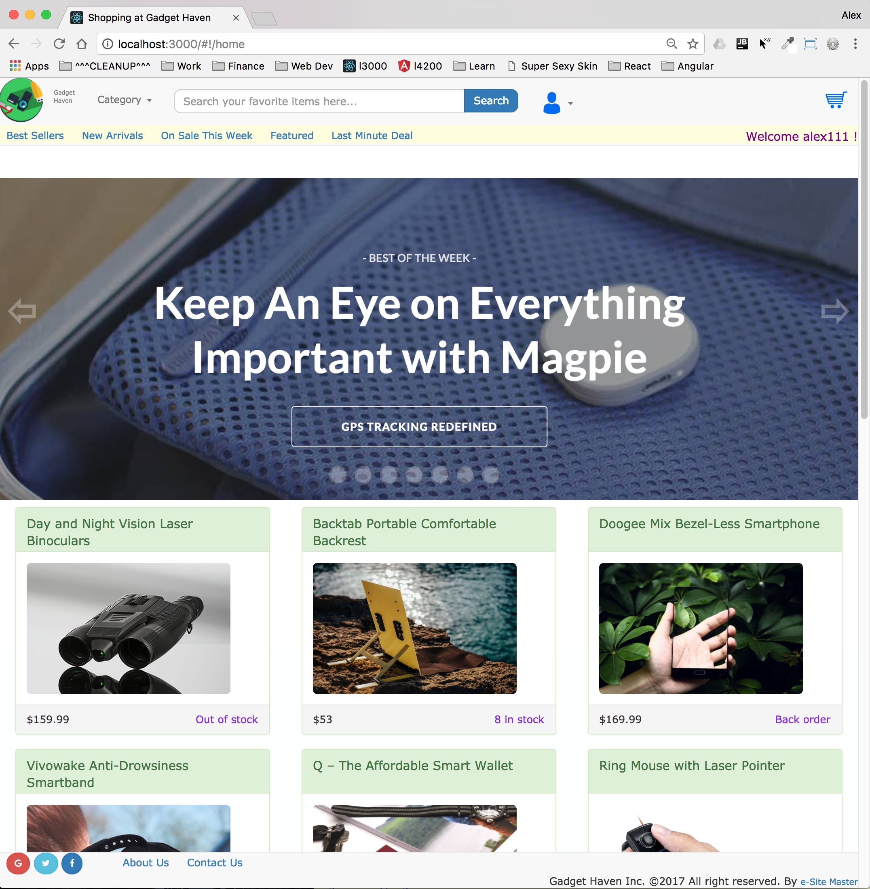
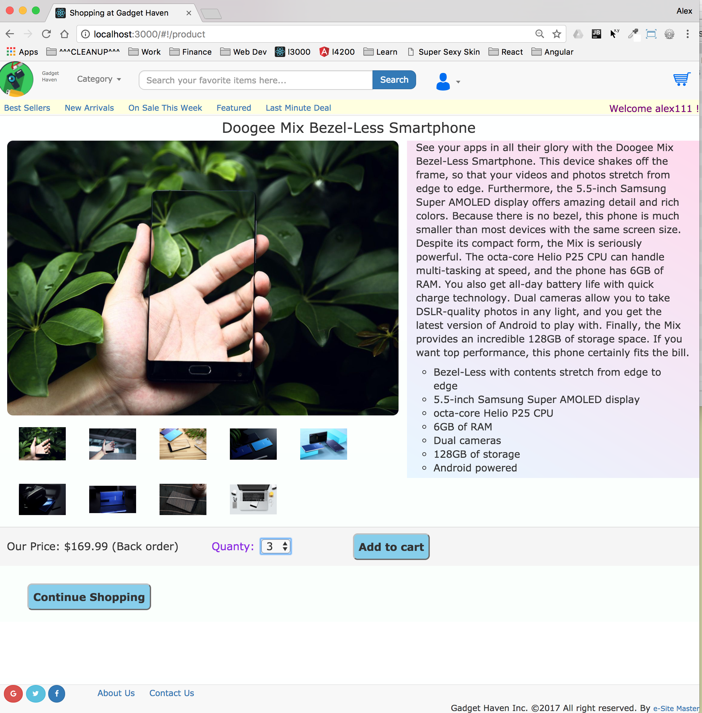
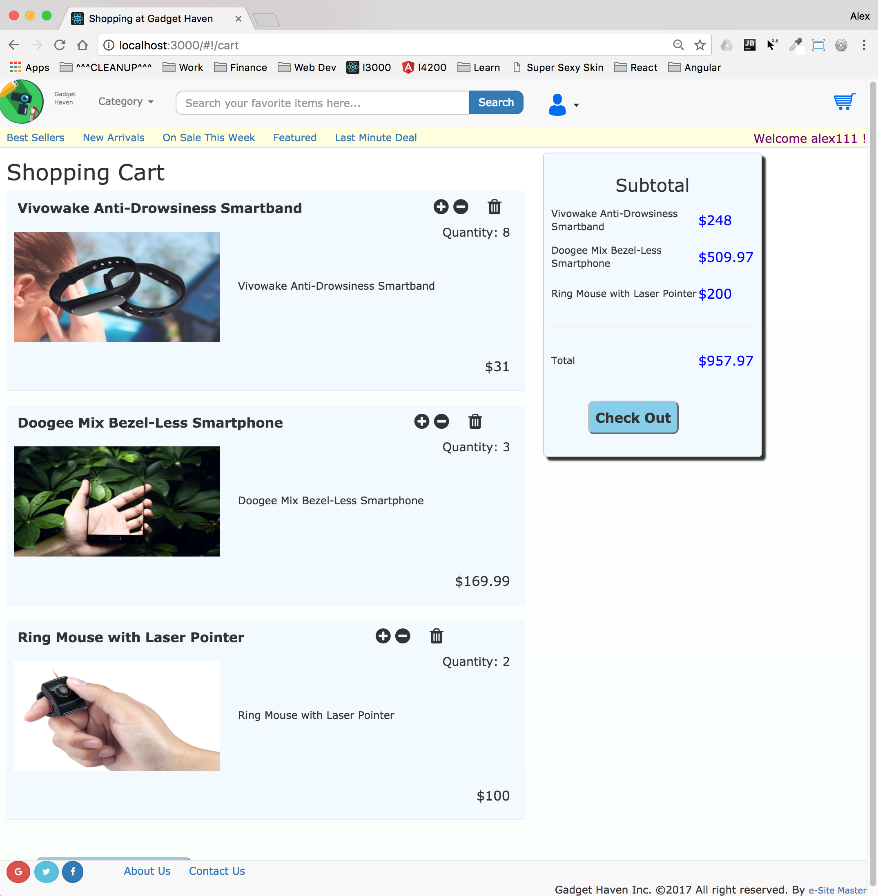
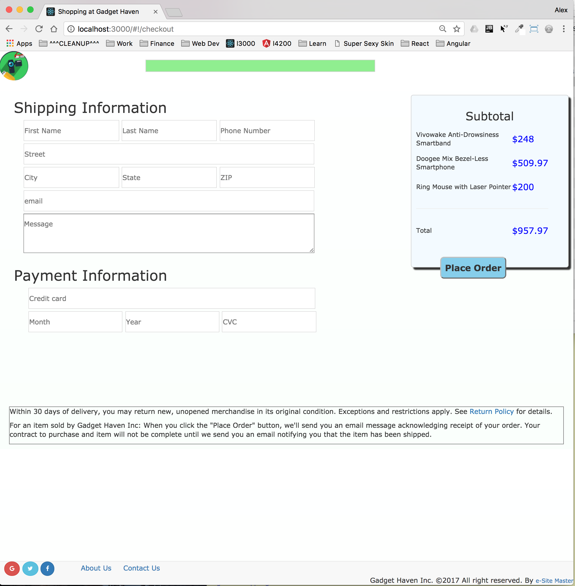
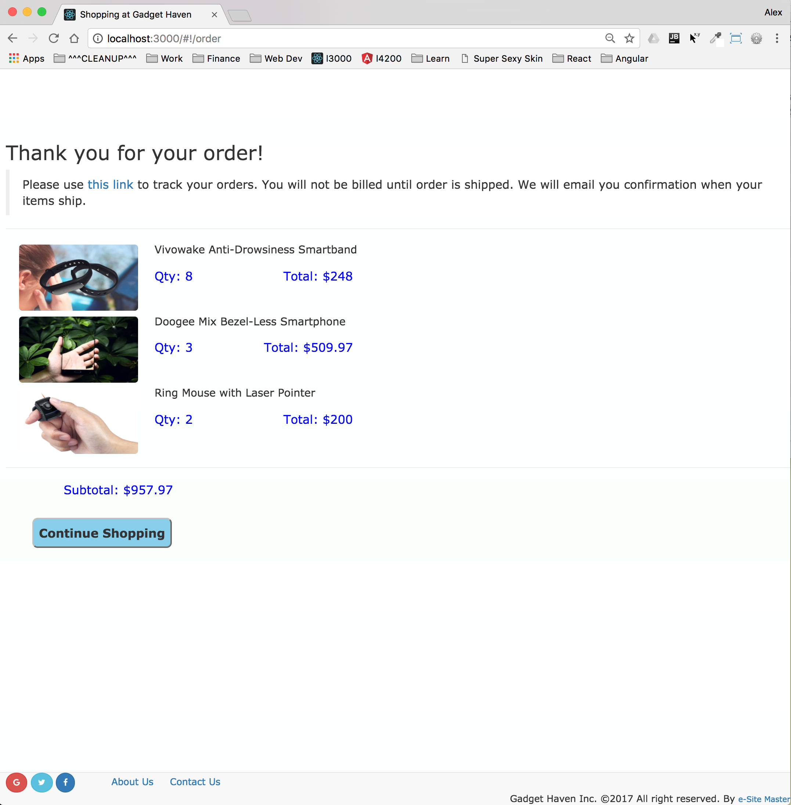
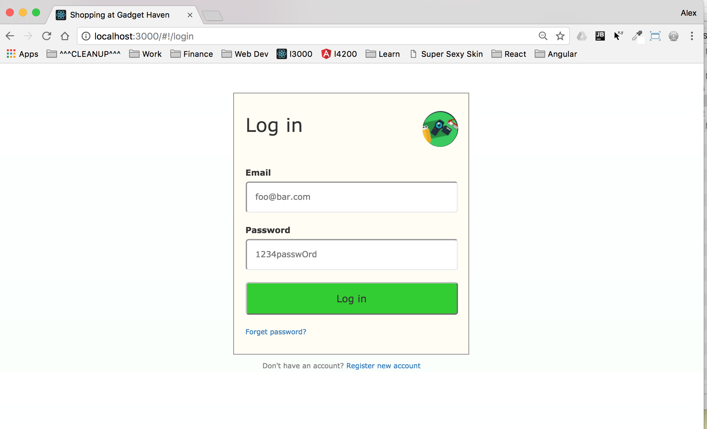

This project features a shopping site with the basic ability for registered users to browse
products on sale and place orders.  This is part of the CodeGarage class project. 

Please refer to this github repository: https://github.com/shorebird2016/gadget-haven

Demo: https://gadget-haven.herokuapp.com/

#### Main Goals
- Experience full-stack development from front end to backend using MEAN stack.
- Construct this product from top to bottom all by myself
- Implement with the following technologies, each one under sub-project folders:
    1. Plain vanilla HTML/CSS/JavaScript
    2. AnagularJS
    3. Angular (2/4)
    4. ReactJS

#### Sample Screen Shots








#### Features
- Spinning logo(and company name) on header bar
- Category dropdown to assist user search
- User may type in search criteria and auto-complete
- New user registration
- User profile management
- ....

#### Folder Structure

The source tree looks like this:
```
carousel/
  README.md
  node_modules/
  package.json
  public/
    index.html
    favicon.ico
  src/
    App.css
    App.js
    App.test.js
    index.css
    index.js
    logo.svg
    asset/
        slider1.png
        slider2.png
        slider3.png
        slider4.png
    carousel/
        carousel.js
        main.sass
```
To change delay - change value for switchInterval prop in ms (default 5000)

#### Dev Logs
- 2017-08-05 After some delays for learning Angular 4 and taking CodeGarage classes, I'm finally back
  back on this project for a day or two. 

#### Plans / Ideas
- 2017-08-05 On the home page, when user first loads the app, the main window will rotate 360 and fly into
  the center with increasing size as a practice of animation.
- 2017-08-08 Minor changes 
    - Once logged-in, user remains logged-in 
    - Different profile icon menu for logged-in vs not logged-in 
    - Display login name on right end of 2nd header line 
    - User information is now stored in local storage keyed off unique email. 
    - Work with empty local storage initially.
    - In profile page, change country will automatically change state/city, change state will automatically
      change city list.
    - After logout then login, all form fields should be cleared.
    - Disable email field on profile page if user already logged in, 
      other fields can be changed but not email.
- 2017-08-09 
    - Special admin user with hard-coded login who has ability to delete users.
    - For new user registration, country/state/city dropdowns and gender radio buttons
      are all empty when user clicks browser refresh, login, register
    - Replace bootstrap carousel with my own (without angularJS to start)
    - sb-carousel - buttons are not dimmed to start, do not light up on hover
    - sb-circle - also not dimmed, or light up on hover
    - sb-circle needs to light up for current image
    - sb-carousel - slide back/forth image slides from right to left, when reaching the end
        slide from left to right (to avoid big jump at the end)
- 2017-08-10        
    - Blend my carosel into angularJS world, use AngularJS ng-repeat to put down images 
      (opposed to hard code)
    - Add arrow buttons and circle buttons to AngularJS world too
    - Remove circle outline such that a blue square won't show after click
    - Re-start slide show 15 seconds after user click
    - Center 'sb-circle-box' during init
    - Push current code to github and heroku under the name "gadget-haven"
    - Light up circle button to match image position
    - Add a few more slides to the asset folder (22 so far)
- 2017-08-12
    - When hover over product thumbnails, the card zoom out 10% to catch attention
    - Home page: Header features
        - Search box should stretch/shrink with the width of window to fill up all the space
-2017-08-13
    - Home page: Header features
        - Type letters and matching product descriptions will show up in a hidden div which can be scrolled and selected
        - Selecting from the list will place the string inside text field and close drop-down list
        - Click  search button or hit enter key will navigate to product page
        - Show a small thumbnail in the search list drop-down
        - Move product data out of app.js to allow moving to DB later easily, also it should be easy to migrate to MongoDB
            or MySQL not by typing of copying and pasting
        - Perform category search - re-populate thumbnails with products from this category, this means every
          profuct has a categroy property which is an array of strings (a product could belong to several categories)
        - Hover over logo will enlarge it 20%, make "Gadge Haven" artistic
    - Add a few more products, total of 25 are available  
    - Product page
        - Design dynamic drop-down for product quantities based on inventory - if more than 10 in stock, show 10 itmes, 
          if not available, quantity drop-down and add button are hidden
    - General
        - Split out carousel code into homeCtrl (home.js) instead of keeping in app.js, this 
          should make carousel code easy to maintain
    - Push to both Heroku and Github  
-2017-08-14
    - Total of 31 products in DB
-2017-08-15
    - Home Page
        - Fix Bug - after displaying sub-category thumbnails, back to all category shows blank thumbs
        - Carousel - randomly pick 8 full size images from all product images for showing
          Choose a set of product images randomly every day to show in carousel, don't use separate ones
        - Force images to be equal width/height such that carousel doesn't show white space on top
    - General Design
        - A new service called "dataProvider" is created to share data among controllers
    - Total of 34 products in DB
-2017-08-16
    - Total of 41 products in DB
    - Fix bug: less than 8 slides are generated
-2017-08-17
    - Home page: carousel
        - Add jumbo text in the center to show name, slightly smaller text below to describe first set of features
          plus a button to navigate to this product in product page immediately
        - Change text when carousel slides
    - Total of 45 products in DB
-2017-08-18


- Next steps 
    - Home page: Header features
        - Use separator to group categories for easy access
        - After click search item, keep cursor inside text field
        - Add heart symbol on top, search/filter icons, mimic gadget flow site, keeping list of favorite products
        - Shopping cart icon should show item counts
            (??? how to control SVG to add/delete vectors)
        - Design actions for each menu item on sub-header, mimic Gadget Flow/Amazon behavior
            [randomly select a set of products, put them inside carousel with artificial banners]
    - Home page: Carousel features    
        - Bug: Click circle lights it up but didn't turn off previous circle  
        - (1)Center 'sb-circle-box' (2)Compute height to maintain aspect ratio during brwoser resize
        - Hover over circle should light up (??? Angular binds them such that CSS won't work any more)
        - Suspect multiple timers after consecutive circle clicks causes fast firing
        - How to detect background color (dark or light) to change jumbo text color accordingly
        - Center jumbo multiline text based on browser width just like circle buttons box
            (??? how to find out exact width of a block of lines)
        - Change first feature bullet to describe the product better, upper case 1st letter
    - Home page: thumbnail    
        - Infinity scrolling, loads about 20 initially, when bottom is reached, add 50 more, till all products are consumed
    - Product page
        - Mouse over thumbnails will automatically show in full size instead of click to show
            [use different event]
        - Search text should be cleared after search in product page
        - Bug: Sometimes thumbnails show up but main image doesn't, maybe previously stored image name 
            is still around (eg. duvet/full-image/v7.jpg doesn't exist)
        - Add special strip with slightly smaller cards and arrows on both ends to manually
          move products back and forth similar to Amazon's, this is typically for something that's related to 
          product user is looking at
            [Nice nifty feature, similar to "These products may be of interest to you"]
    - Profile pages        
        - Make disabled fields obvious (gray out)
        - New item - wish list
    - Settings page
        - Make carousel interval user adjustable, put in setting page
        - More user controllable view features (??? what are they)
    - Backend, database
        - Regroup products into two level categories similar to Gadget Flow
        - Move user data under NodeJS control.  Later on maybe changing to PassportJS and MongoDB.
    - General
        - Split logic out to individual controllers (eg. home ctrl, product ctrl...etc) to modularize, also good
            basis for componentization, overlapping data must be in app.js
        - Animation - when user clicks to navigate to other pages use sliding 
        - Upgrade this app to run in both Angular 4 and ReactJS
        - Add tooltips to all user clickable items

#### Knowledge Learned
- ```<a href="#" ng-click="SHOPPING_CTRL.clickProfile()">``` 
  does NOT seem to 
  engage route change, had to replace ```<a> with <i> or <div>``` and 
  change image margin top to make image line up
  
- After setting new path via ```$location.path()```, must call ```$scope.$apply()```
  to trigger DOM change, otherwise it takes 2 clicks.
  
- ``` document.getElementsByClassName('sb-circle-box') ``` is undefined for
  plain vanilla version home.html mixed with AngularJS, possibly due to Angular's router comes 
  on later after page load to load home.html partial
  
- Plain vanilla JS - can't track current slide position and nav to product page
  also difficult to swap image deck on the fly, mix it with AngularJS is a poor practice
  
- $interval(vm.funcXXX, 1000) MUST be called after vm.funcXXX is defined, hoisting won't do it
  but if just funcXXX() then it's ok
  
- Had a strange phenomena trying to check into github/deploy heroku - profile folder is completely broken on github
  and not found on heroku.  The only way to work around this is to re-create new repository and app.
  
- In route configuration, if controller is specified, and this controller is also specified in HTML ng-controller,
  then the controller will be run twice
      $routeProvider.when('/home', {
         templateUrl: 'app/home/home.html'
         controller: 'homeCtrl'  <=== will execute controller once
      })
  ``` <section class="sb-carousel" ng-controller="homeCtrl as HOME_CTRL"> ```  <== will execute once again 
  
- When changing to N slides in carousel, .sb-slide-image width = 1/N% and .sb-slider-box width = N * 100%  

- JSON schema ?
