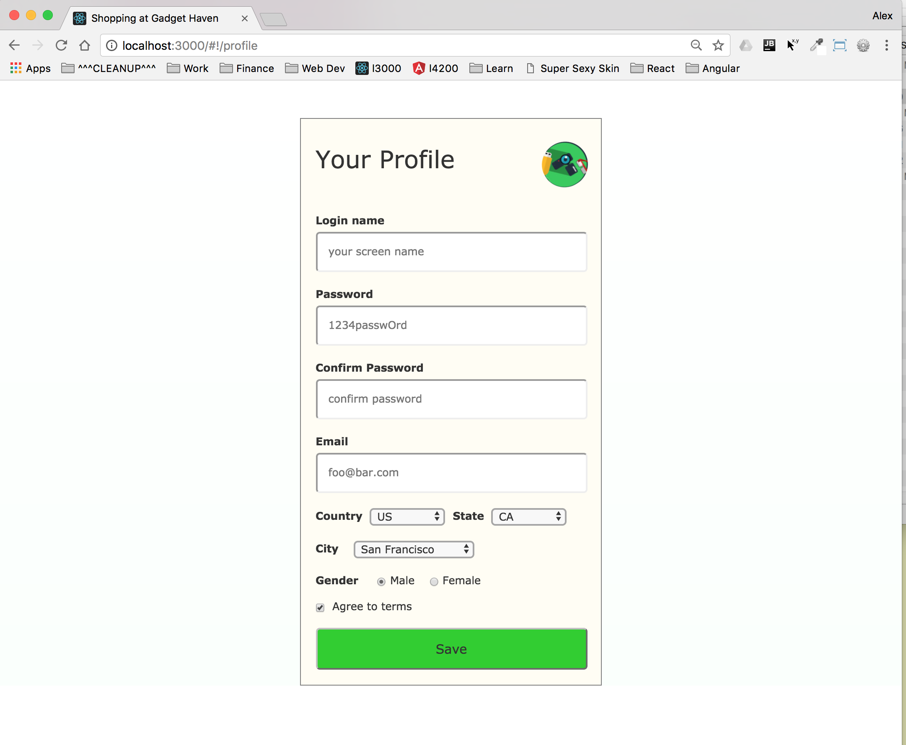
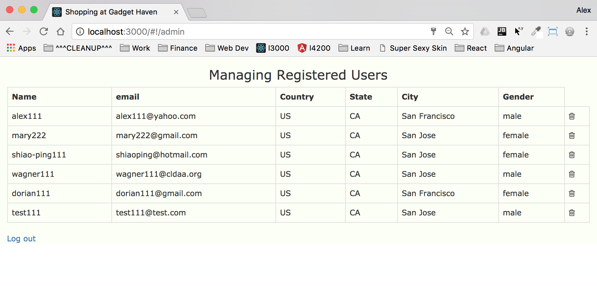

This project features a shopping site with the basic ability for registered users to browse
products on sale and place orders.  This is part of the CodeGarage class project. 

Please refer to this github repository: https://github.com/shorebird2016/gadget-haven

Demo: https://gadgen-haven.herokuapp.com/

#### Main Goals
- Experience full-stack development from front end to backend using MEAN stack.
- Construct this product from top to bottom all by myself
- Implement with the following technologies, each one under sub-project folders:
    1. Plain vanilla HTML/CSS/JavaScript
    2. AnagularJS
    3. Angular (2/4)
    4. ReactJS

#### Sample Screen Shots





#### Features
- Spinning logo(and company name) on header bar
- Category dropdown to assist user search
- User may type in search criteria and auto-complete
- New user registration
- User profile management
- ....

#### Folder Structure

The source tree looks like this:
```
carousel/
  README.md
  node_modules/
  package.json
  public/
    index.html
    favicon.ico
  src/
    App.css
    App.js
    App.test.js
    index.css
    index.js
    logo.svg
    asset/
        slider1.png
        slider2.png
        slider3.png
        slider4.png
    carousel/
        carousel.js
        main.sass
```
To change delay - change value for switchInterval prop in ms (default 5000)

#### Dev Logs
- 2017-08-05 After some delays for learning Angular 4 and taking CodeGarage classes, I'm finally back
  back on this project for a day or two. 

#### Plans / Ideas
- 2017-08-05 On the home page, when user first loads the app, the main window will rotate 360 and fly into
  the center with increasing size as a practice of animation.
- 2017-08-08 Minor changes 
    - Once logged-in, user remains logged-in 
    - Different profile icon menu for logged-in vs not logged-in 
    - Display login name on right end of 2nd header line 
    - User information is now stored in local storage keyed off unique email. 
    - Work with empty local storage initially.
    - In profile page, change country will automatically change state/city, change state will automatically
      change city list.
    - After logout then login, all form fields should be cleared.
    - Disable email field on profile page if user already logged in, 
      other fields can be changed but not email.
- 2017-08-09 
    - Special admin user with hard-coded login who has ability to delete users.
    - For new user registration, country/state/city dropdowns and gender radio buttons
      are all empty when user clicks browser refresh, login, register
    - Replace bootstrap carousel with my own (without angularJS to start)
    - sb-carousel - buttons are not dimmed to start, do not light up on hover
    - sb-circle - also not dimmed, or light up on hover
    - sb-circle needs to light up for current image
    - sb-carousel - slide back/forth image slides from right to left, when reaching the end
        slide from left to right (to avoid big jump at the end)
- 2017-08-10        
    - Blend my carosel into angularJS world, use AngularJS ng-repeat to put down images 
      (opposed to hard code)
    - Add arrow buttons and circle buttons to AngularJS world too
    - Remove circle outline such that a blue square won't show after click
    - Re-start slide show 15 seconds after user click
    - Center 'sb-circle-box' during init

- Next steps 
    - Center 'sb-circle-box' during brwoser resize too
    - Add a few more slides to the asset folder
    - Light up circle button to match image position
    - Make slide interval user adjustable
    - Resize browser window horizontally causes carousel to open gap on top, 
      seems to need some kind of dynamic margin, this is probably due to changing 
      height of images when browser gets wider.
    - how to accommodate various image heights? slide 4 is taller than others
    - Image gallery - when hover over a card, it should animate by zooming out 10%
    - Admin can remove user from a list  
    - Make disabled fields obvious (gray out)
    - Apply the user-registration class app to register users and store their information under
        NodeJS control.  Later on maybe changing to PassportJS.
    - Replace bootstrap carousel with my own carousel component  
    - Animation - when user clicks product image and navigate to full page product via 
        slide in from left
    - At login time(vm.login()), if user is not found, the code manipulate DOM directly, change to Angular way
    - Upgrade this app to run in both Angular 4 and ReactJS    

#### Knowledge Learned
- ```<a href="#" ng-click="SHOPPING_CTRL.clickProfile()">``` 
  does NOT seem to 
  engage route change, had to replace ```<a> with <i> or <div>``` and 
  change image margin top to make image line up
  
- After setting new path via ```$location.path()```, must call ```$scope.$apply()```
  to trigger DOM change, otherwise it takes 2 clicks.
  
- ``` document.getElementsByClassName('sb-circle-box') ``` is undefined for
  plain vanilla version home.html mixed with AngularJS, possibly due to Angular's router comes 
  on later after page load to load home.html partial
  
- Plain vanilla JS - can't track current slide position and nav to product page
  also difficult to swap image deck on the fly, mix it with AngularJS is a poor practice
  
- $interval(vm.funcXXX, 1000) MUST be called after vm.funcXXX is defined, hoisting won't do it
  but if just funcXXX() then it's ok